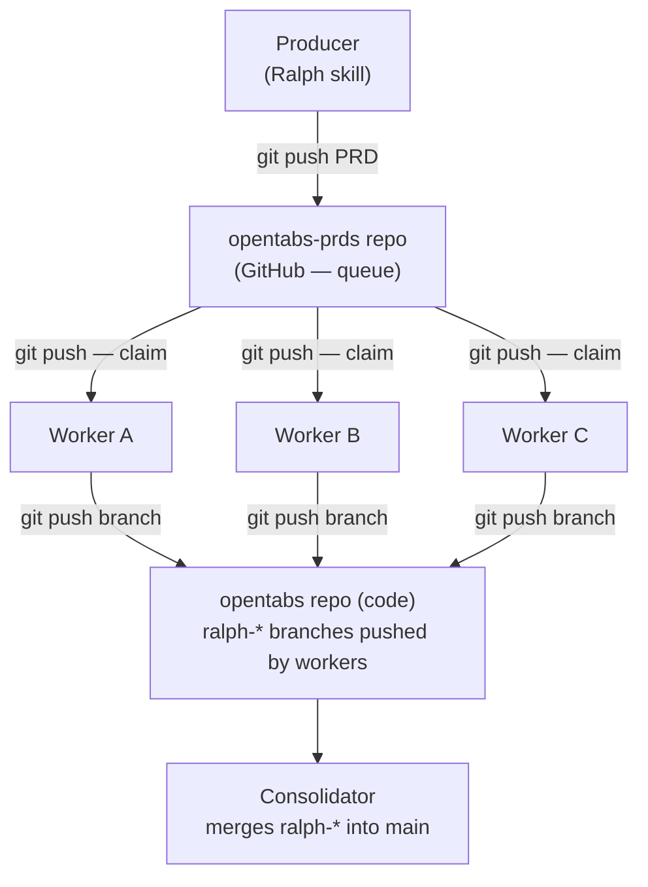

# opentabs-prds

Git-based distributed work queue for building [OpenTabs](https://github.com/opentabs-dev/opentabs). PRD files are the unit of work — producers publish them, distributed workers claim and execute them atomically, and a consolidator merges the results back into main.

This is the complete development record for OpenTabs. Every feature, every bugfix, every plugin — it started as a PRD in this repo. If you're curious about AI-driven development or want to run a similar setup for your own project, everything here is open source and MIT-licensed. Take what's useful.

## How It Works

The idea is simple: `git push` to a single branch is serialized by GitHub. When two workers try to claim the same PRD simultaneously, the first push wins and the second gets a non-fast-forward rejection — a natural compare-and-swap. The losing worker retries with a different PRD. No database, no message broker, no coordinator. Just git.



Three scripts, three jobs:

1. **producer.sh** publishes PRDs to the queue
2. **consumer.sh** claims PRDs and runs AI workers in Docker containers
3. **consolidator.sh** merges completed branches back into main

## PRD Lifecycle

```
prd-<slug>~draft.json                              → Producer is writing (not yet published)
prd-<ts>-<slug>-<hash>.json                        → Ready for pickup (published to queue)
prd-<ts>-<slug>-<hash>~running.json                → Claimed by a worker (atomic via git push)
prd-<ts>-<slug>-<hash>~done.json                   → Worker finished
archive/YYYY-MM-DD/prd-<name>~done/                → Final resting place (organized by date)
```

The timestamp is `YYYY-MM-DD-HHMMSS` and the hash is the first 6 characters of the PRD's SHA-256 — this ensures unique filenames even if the same slug is reused for different PRDs.

## Scripts

### producer.sh — Publish PRDs

Takes draft PRD files, validates them, adds a timestamp and content hash, and pushes them to the queue.

```bash
# Publish a single draft PRD
./producer.sh prd-my-feature~draft.json

# Publish multiple PRDs (batched into one commit)
./producer.sh prd-feature-a~draft.json prd-feature-b~draft.json
```

What it does:

- Validates each PRD is valid JSON with a `project` field and at least one user story
- Renames drafts from `prd-<slug>~draft.json` to `prd-<timestamp>-<slug>-<hash>.json`
- Cleans up stale `~running` or `~done` files that shouldn't be in the working tree
- Commits all published PRDs in a single commit
- Pushes to main with retry logic (up to 5 attempts with fetch + rebase on conflict)

Already-ready files (non-drafts) are published as-is. The script requires being on the `main` branch and uses `python3` for JSON validation.

### consumer.sh — Claim and Execute PRDs

Long-running daemon that polls for ready PRDs, claims them atomically, and runs AI workers. Each worker gets its own git worktree and (by default) its own Docker container.

```bash
# Start with defaults (6 workers, Docker isolation, poll every 10s)
./consumer.sh --code-repo https://github.com/opentabs-dev/opentabs.git

# Single batch, no Docker, 3 workers
./consumer.sh --code-repo https://github.com/opentabs-dev/opentabs.git \
  --once --no-docker --workers 3

# Full options
./consumer.sh \
  --code-repo https://github.com/opentabs-dev/opentabs.git \
  --queue-repo https://github.com/opentabs-dev/opentabs-prds.git \
  --tool claude \
  --workers 6 \
  --poll 10 \
  --worker-id my-machine-01
```

| Flag | Default | Description |
|------|---------|-------------|
| `--code-repo <url>` | *(required)* | Git URL or local path for the code repo |
| `--queue-repo <url>` | *(inferred from origin)* | Git URL for the queue repo |
| `--tool <name>` | `claude` | AI tool to use (`claude` or `amp`) |
| `--workers <n>` | `6` | Number of parallel worker slots |
| `--poll <n>` | `10` | Poll interval in seconds |
| `--once` | `false` | Process available PRDs then exit |
| `--no-docker` | `false` | Run workers directly on host instead of Docker |
| `--worker-id <id>` | *auto-generated* | Unique identifier for this consumer instance |

**Docker isolation.** By default, each worker runs in a Docker container (`ralph-worker:latest`) with `--network host`, `--shm-size=2g`, and the host user's UID/GID. SSH credentials, `.npmrc`, and Claude settings are mounted read-only into a staging directory and copied in at container startup. No CPU or memory caps — the OS scheduler handles sharing.

**Hot-reload worker count.** Send `SIGHUP` to scale workers up or down without restarting:

```bash
echo 'workers=8' > ~/.ralph-consumer/config
kill -HUP $(cat ~/.ralph-consumer/.consumer.pid)
```

Scaling up takes effect immediately. Scaling down lowers the cap but lets active workers in higher slots finish their current PRD before draining.

**Branch resumption.** If a consumer restarts and a `ralph-*` branch already exists on the remote for a claimed PRD, the worker picks up where it left off instead of starting from scratch. Completed user stories are detected from commit messages and marked as passed in the PRD.

**Merge-ready signal.** When a worker finishes successfully, it pushes a `ralph-<slug>-merge-ready` branch alongside the work branch. The consolidator only merges branches with this suffix, so it never touches in-progress work.

**Graceful shutdown.** On exit, the consumer saves uncommitted work, pushes branches, and reverts all `~running` PRDs back to ready state so other consumers can pick them up.

**Resource monitoring.** A background process logs system load, RAM usage, and per-container CPU/memory stats every 20 seconds.

### consolidator.sh — Merge Branches into Main

Finds completed `ralph-*-merge-ready` branches (oldest first), merges them into main, and cleans up the signal branches. Work branches are never deleted.

```bash
# Merge all available branches and exit
./consolidator.sh --code-repo https://github.com/opentabs-dev/opentabs.git --once

# Run as daemon, check every 30s (default)
./consolidator.sh --code-repo https://github.com/opentabs-dev/opentabs.git

# Dry run — show what would be merged
./consolidator.sh --code-repo https://github.com/opentabs-dev/opentabs.git --dry-run --once
```

| Flag | Default | Description |
|------|---------|-------------|
| `--code-repo <url>` | *(required)* | Git URL or local path for the code repo |
| `--once` | `false` | Merge available branches then exit |
| `--poll <n>` | `30` | Poll interval in seconds |
| `--dry-run` | `false` | Show what would be merged without doing it |
| `--model <model>` | `claude-opus` | AI model for conflict resolution |

**Two-phase merge strategy:**

1. **Phase 1 — Fast-forward merge.** Tries a clean `git merge` up to 3 times (retrying if the remote advances). If there are no conflicts, this is all that happens.

2. **Phase 2 — AI-assisted conflict resolution.** If Phase 1 hits conflicts, the consolidator hands the merge to Claude with the PRD file for context. The AI reads the PRD to understand intent, resolves conflicts, verifies the build passes (`npm run build && npm run type-check`), and pushes. There's a 15-minute timeout. If the AI can't resolve it, the branch is preserved for the next attempt.

The consolidator reads PRD files from the code repo's `.ralph/` directory, the queue repo, or the archive to give the AI full context about what each branch was trying to accomplish.

## Directory Structure

```
opentabs-prds/
├── producer.sh             # Publish PRDs to the queue
├── consumer.sh             # Claim + execute PRDs (distributed workers)
├── consolidator.sh         # Merge completed branches into main
├── CLAUDE.md               # AI agent instructions for this repo
├── LICENSE                  # MIT license
├── .gitignore
├── prd-*.json              # Ready PRDs (waiting for workers)
├── prd-*~running.json      # PRDs being executed
├── prd-*~done.json         # Completed PRDs (pre-archive)
├── progress-*.txt          # Worker progress logs
├── archive/                # Completed PRDs organized by date
│   └── YYYY-MM-DD/
│       └── prd-<name>~done/
│           ├── prd-*~done.json
│           └── progress-*.txt
└── README.md
```

## Worker Data Locations

Each consumer stores its working data in `~/.ralph-consumer/`:

```
~/.ralph-consumer/
├── .consumer.pid         # PID lock file
├── config                # Hot-reload config (workers=N)
├── queue/                # Local clone of opentabs-prds
├── code/                 # Local clone of opentabs
├── worktrees/            # Git worktrees for each active PRD
│   └── <slug>/
│       └── .ralph/       # PRD file, progress, worker script
└── logs/                 # Date-rotated logs (180-day retention)
    ├── YYYY-MM-DD.log
    └── latest.log → current day's log
```

The consolidator stores its data in `~/.ralph-consolidator/`:

```
~/.ralph-consolidator/
├── .consolidator.pid     # PID lock file
├── code/                 # Local clone of opentabs
└── logs/                 # Date-rotated logs (180-day retention)
    ├── YYYY-MM-DD.log
    └── latest.log → current day's log
```

Both use the `RALPH_TZ` environment variable for timestamps (defaults to `America/Los_Angeles`).

## Disclaimer

This software is provided "as is", without warranty of any kind. It interacts with third-party services (GitHub, AI providers) using your existing credentials. You are responsible for ensuring your use complies with the terms of service of any platforms you connect to. The authors and contributors are not responsible for any unintended actions, data loss, or other consequences that may result from using this tool.

## License

[MIT](LICENSE)
